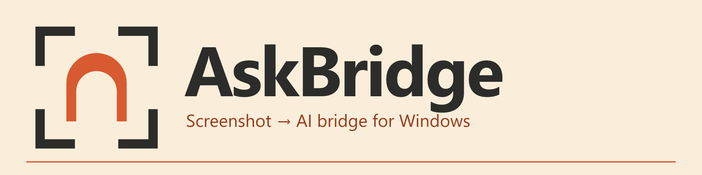

# AskBridge

[简体中文](README.md) | [English](README_EN.md)

<p align="center">
  
</p>

AskBridge is a Windows screenshot-to-AI tool. After selecting an area of the screen, you can copy the capture, switch AI models, or stage the screenshot together with preset text into an AI website's input box. Whether to actually send is always decided by the user.

## Download and Setup

1. Go to [GitHub Releases](https://github.com/wanghongyu666qiang/AskBridge/releases) and download the latest `AskBridge-<version>-Setup.exe`.
2. Run the installer, choose a dedicated installation directory, and select whether to create Desktop and Start menu shortcuts or start AskBridge after sign-in. The installer does not choose a C-drive directory by default.
3. Select Install, then launch AskBridge from the shortcut you selected. The program lives in the Windows tray; right-click the tray icon to open settings or exit.

AskBridge checks GitHub Releases in the background after startup and then once every 24 hours. When a new version is available, it shows a tray notification; you can also choose "Check for updates" from the tray menu. Builds installed through `Setup.exe` download the official installer into `data/Updates` only after you confirm (with progress shown in the settings window), verify its release SHA-256 plus the maintainer's offline Ed25519 signature, exit cleanly, upgrade in place, and restart. If launching the installer fails, choose "Install" from the tray menu again to reuse the verified download without re-downloading. Updates preserve all files under `data`, and a failed update restores the previous program files. Portable builds notify you about new versions but must be replaced manually from the official Release.

Regular users do not need to open PowerShell or run any command from the repository's `scripts` directory.

When developing in this repository, the debug build is located at `target/debug/askbridge.exe` and the release build at `target/release/askbridge.exe`.

## Hotkeys

| Hotkey | Action |
| --- | --- |
| `Alt+Q` | Select a screen region and show the toolbar |
| `Alt+Shift+Q` | Select a region, then stage web content using the default model and quick prompt without showing the toolbar |
| `Alt+W` | Open the default model's website and type directly on the page |
| `Esc` | Cancel in the capture overlay |
| `Enter` | In the capture toolbar, confirm the currently selected model |

After switching models in the capture toolbar, the new choice is saved as the default model for next time. A screenshot is written to the clipboard only when you click "Copy", explicitly choose "Copy last screenshot to clipboard" from the tray, or use a configured universal-paste path.

## Browser Selection

AskBridge supports ChatGPT, Gemini, Claude, Doubao, DeepSeek, Zhipu Qingyan (GLM), Kimi, and custom HTTPS providers.

ChatGPT offers four opening modes under "Settings > Browser":

- **Desktop web**: reuses your existing login. For screenshot requests, AskBridge focuses one unambiguous editor, synthesizes one Ctrl+V, and reports success only after stable new attachment structure appears; you still send manually. Text-only requests only open the page.
- **AskBridge-managed Chrome**: supports automatic screenshot upload after a one-time sign-in inside the isolated browser.
- **Universal paste**: writes the screenshot to the clipboard, focuses a matching provider page or supported AI desktop-client window, and synthesizes one Ctrl+V; you confirm and send manually. This mode can use the login state in your daily browser or the ChatGPT, Claude, and Doubao desktop clients. AskBridge reports success only after stable new attachment structure appears near one unambiguous editor. When no matching window is open, it opens a new page in the default browser. If the paste was executed but the attachment state remains uncertain, AskBridge stops and asks you to inspect the page; it never pastes again automatically.
- **Dedicated Chrome first, safe fallback to universal paste**: screenshot requests are staged by the dedicated Chrome first; only when a failure happens before any text or attachment has been written does AskBridge automatically fall back to one Ctrl+V. If anything may already have been written, AskBridge stops instead of pasting again. Text-only requests still use the dedicated Chrome only.

The managed Chrome uses a dedicated `BrowserProfile` and never connects to or modifies your daily Chrome profile.

## Usage Boundaries

- AskBridge does not call model APIs and does not run local models.
- AskBridge does not read passwords, verification codes, cookies, page content, or chat history.
- AskBridge does not log question text, screenshot content, clipboard content, or full chat URLs.
- AskBridge never clicks a website's send button automatically; `auto_submit` is fixed to `false` for all requests.
- If a login expires, the page structure changes, or attachment preparation fails, the operation stops and shows the reason.

## Data Locations

- Source development environment: the `data` directory at the repository root (detected automatically when running debug builds from `target`)
- Installed or portable builds: the `data` directory next to `askbridge.exe`
- Custom location: set the `ASKBRIDGE_DATA_DIR` environment variable to an absolute path

Configuration, logs, the managed browser profile, and update downloads live at `data/config.json`, `data/logs`, `data/BrowserProfile`, and `data/Updates` respectively. Temporary screenshots used for web upload remain available for asynchronous page reads for up to 10 minutes and are then deleted; files left by an abnormal exit and used or stale update installers are cleaned on a later launch.

See [Privacy Notes](docs/PRIVACY.md) and [Troubleshooting](docs/TROUBLESHOOTING.md) for more information.

## Development

Requires stable Rust with a Windows GNU or MSVC toolchain, plus the Microsoft Edge WebView2 Runtime.

```powershell
cargo fetch --locked
cargo test --workspace --locked --offline
cargo build --workspace --release --locked --offline
cargo run --package xtask --locked --offline -- help
```

The `scripts` directory contains project maintenance automation, not user-facing steps:

- `build.ps1` and `test.ps1` are the daily build and test entry points.
- `package.ps1` and `test-release-local.ps1` are the packaging and full release acceptance entry points.
- `test-*` and `validate-*` are standalone checkers invoked by the entry points above, validating installation, path guards, and real UI behavior.
- `measure-*` are independent performance-measurement helpers that you run manually when profiling.
- `cargo xtask` holds performance-report and release-artifact validation logic that can be tested as pure Rust.
- `Install-AskBridge.ps1` and `Uninstall-AskBridge.ps1` are packaged into release artifacts.

<details>
<summary>Release maintenance commands</summary>

Full local release acceptance:

```powershell
./scripts/test-release-local.ps1 -AcceptanceRoot D:/AskBridge/target/release-local-acceptance-20260902
```

Replace `AcceptanceRoot` with a new, non-existent absolute path under the current repository's `target` directory.

An explicit empty directory must be provided when generating installer and portable packages:

```powershell
./scripts/package.ps1 -ArtifactRoot D:/your-chosen-release-directory
```

Scripts never write release artifacts to the C drive by default.

Pushing an ordinary commit runs CI but does not create a Release. For a release, update the version in `Cargo.toml`, complete local acceptance, and push a matching `vX.Y.Z` tag. `.github/workflows/release.yml` then re-runs formatting, Clippy, tests, and the release build on Windows MSVC, creates the installer, portable ZIP, and SHA-256 manifest signed offline with the repository secret key using Ed25519, and publishes the GitHub Release:

```powershell
git push origin main
git tag vX.Y.Z
git push origin vX.Y.Z
```

Releases rely on the signing private key stored in the `UPDATE_SIGNING_KEY` GitHub Actions secret (hex encoded). To generate a key pair locally:

```powershell
cargo xtask gen-update-key --output <absolute-path>
```

Local packaging likewise requires either `-UpdateSigningKeyFile` or the `ASKBRIDGE_UPDATE_SIGNING_KEY` environment variable; otherwise packaging fails.

</details>

## License

This project is licensed under the [Apache License 2.0](LICENSE).
