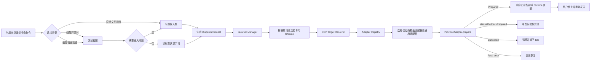
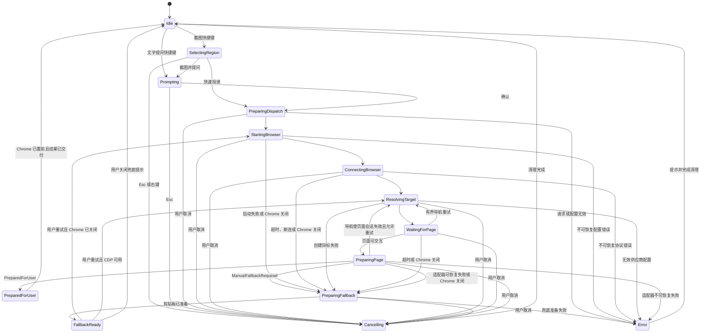

# AskBridge 开发者文档

> 文档版本：2.1
> 文档状态：开发基线
> 更新日期：2026-07-29
> 目标平台：Windows 10 / Windows 11
> 核心技术：Rust + Win32 + 桌面 PWA + AskBridge 专用 Chrome + Chrome DevTools Protocol（CDP）
> 产品定位：通过可自定义全局快捷键，把截图或文字快速投递到用户选择的 AI 网页
> 正式版边界：不调用模型 API，不保存聊天记录，不在本地展示 AI 回答，不依赖浏览器扩展

---

# 1. 项目概述

AskBridge 是一个超轻量的 Windows 一键问屏工具。

它通过全局快捷键完成以下三类任务：

1. 框选截图，输入与截图相关的问题，再投递到 AI 网页；
2. 框选截图，使用用户配置的默认提示词快速投递；
3. 不截图，直接输入文字问题并投递。

AskBridge 本身不运行 AI 模型，也不重新实现聊天产品。用户最终仍在 ChatGPT、Gemini、Claude、豆包等原始网页中查看回答和继续对话。

AskBridge 将传统流程：

```text
手动截图
→ 打开或切换浏览器
→ 找到 AI 网页
→ 上传截图
→ 输入问题
```

缩短为：

```text
按快捷键
→ 框选或输入
→ 自动投递
```

## 1.1 文档示例约定

本文所称“投递完成”“准备成功”或 `PreparedForUser`，统一表示截图和文字已经放入目标网页输入区，且所选桌面 PWA 或专用 Chrome 已置前等待用户检查；不表示消息已经发送。

本文中的示例按以下规则解释：

- 标为 **伪代码** 的示例只描述模块 interface、控制流或实现方向，不保证可直接编译或执行；Codex 不得机械复制为生产代码；
- 标为 **参考实现** 的示例必须语义完整、引用类型明确，并可作为实现基线；实现时允许因所选 crate 的具体类型做等价调整，但不得改变文档定义的行为；
- `text` 与 Mermaid 代码块用于描述流程、界面或状态关系，不属于可直接执行代码；
- 未明确标为参考实现的外部命令仅用于说明意图，使用前必须依据当前官方文档和本机行为验证。

---

# 2. 已确认的产品决策

以下内容是本项目的固定开发基线。

## 2.1 必须保留

- Windows 原生常驻程序；
- 三种核心快捷操作；
- 所有快捷键均可修改、禁用和恢复默认；
- 区域截图；
- 多显示器和高 DPI 支持；
- 默认供应商与临时切换供应商；
- AskBridge 专用 Chrome 用户数据目录；
- 通过 CDP 控制专用 Chrome；
- 可按供应商选择现有桌面 PWA；ChatGPT 默认复用用户桌面的 `ChatGPT.lnk` 和已有登录会话；
- 通用网页适配器；
- 必要时使用少量供应商覆盖规则；
- 自动化失败时的剪贴板兜底；
- 1.0 只准备截图和文字并将所选目标载体置前，由用户确认发送；
- 系统托盘；
- 单实例运行；
- 普通用户权限安装和运行。

## 2.2 明确不做

- 不读取或展示历史对话列表；
- 不让用户在 AskBridge 中选择以前的聊天；
- 不保存会话 ID；
- 不同步或保存聊天记录；
- 不保存 AI 回答；
- 不调用 OpenAI、Anthropic、Google 等模型 API；
- 不要求用户配置 API Key；
- 不运行本地模型；
- 不在本地渲染 Markdown、代码块或流式回答；
- 不建立账号系统；
- 不读取用户名、密码、验证码或 Cookie；
- 不导入用户日常 Chrome 配置；
- 不控制用户日常 Chrome 配置；
- 不使用 Electron、Tauri、WebView、CEF 或 Python 常驻进程；
- 不把浏览器扩展作为正式架构依赖；
- 正式程序和发布构建不建立或运行本地 HTTP 或 WebSocket 服务；
- 不持续监控屏幕；
- 不在后台自动截图；
- 不使用长期运行的 Playwright、Selenium 或 WebDriver。

## 2.3 关于“继续当前对话”

AskBridge 不管理历史对话，但可以自然复用专用 Chrome 中当前已经打开的供应商标签页。

桌面 PWA 模式复用该 PWA 自身维护的当前窗口和登录会话；AskBridge 不读取其历史对话、Cookie、密码或网页正文。

规则如下：

```text
能够可靠确认当前聚焦标签，且该标签属于目标供应商
→ 直接使用

否则，恰好只有一个目标供应商匹配标签
→ 使用该唯一标签

否则，没有目标供应商匹配标签
→ 创建该供应商的新标签

否则，存在多个匹配标签且无法可靠确认当前聚焦目标
→ 创建新标签，不猜测、不静默选择

```

AskBridge 不展示标签页选择器，也不记录这些标签对应的聊天 ID。

“当前聚焦”必须由 `TargetResolver` 在本次决策时获得可靠证据。无法确认时一律视为“未知”；不得通过标签标题、CDP Target 返回顺序、数组顺序、窗口标题或自建的过期时间戳猜测。不得引入任何当前方案无法可靠维护的“最后激活”字段。

## 2.4 测试专用本地 HTTP 例外

第 2.2 节的本地服务禁令适用于正式程序、发布构建、安装包和用户运行时。

自动化测试或集成测试可以由测试进程临时监听 `127.0.0.1`，并让操作系统分配随机端口，以提供确定性的本地测试页面。该例外必须同时满足：

- 只绑定回环地址，不监听 `0.0.0.0`、局域网地址或公网地址；
- 监听器只在测试进程生命周期内存在；
- 测试结束或失败清理时自动销毁；
- 端口不写入正式配置、安装包或用户文档；
- 正式二进制不得包含启动该测试监听器的运行路径。

---

# 3. 核心设计原则

## 3.1 桌面端极轻量

AskBridge 空闲时只保留：

- 一个托盘进程；
- Windows 消息循环；
- 全局快捷键注册；
- 必要的应用状态。

空闲时不得：

- 启动专用 Chrome；
- 建立 CDP 连接；
- 轮询浏览器；
- 轮询屏幕；
- 保持高频计时器；
- 发起网络请求。

专用 Chrome 按需启动，其资源占用必须与 AskBridge 桌面进程分开统计和说明。

## 3.2 浏览器隔离

AskBridge 提供两个目标载体 adapter：

- `desktop_pwa`：启动用户现有的桌面 PWA，复用其登录会话；
- `dedicated_chrome`：使用隔离的专用 Chrome 与 CDP。

ChatGPT 默认选择 `desktop_pwa`，其他供应商默认选择 `dedicated_chrome`；用户可在设置中切换 ChatGPT。桌面 PWA 模式不开放或接管日常 Chrome 的调试端点，也不读取其配置数据。

专用 Chrome 模式必须使用独立用户数据目录：

```text
<AskBridge 数据目录>\BrowserProfile
```

AskBridge 数据目录与程序位于同一安装介质：开发工作区默认使用仓库根目录下的 `data`，便携版本默认使用可执行文件旁的 `data`。用户可以在启动前用绝对路径环境变量 `ASKBRIDGE_DATA_DIR` 显式覆盖；不得未经用户确认改用其他磁盘。当前开发机使用 `D:\AskBridge\data`。

不得连接或调试用户日常 Chrome 的默认数据目录。

用户需要在 AskBridge 专用 Chrome 中自行登录各 AI 网页。AskBridge 不接触登录凭据。

## 3.3 自动化可验证

投递不能依赖“固定等待若干秒后盲目粘贴”。

流程必须基于：

- CDP 连接状态；
- 页面和目标状态；
- DOM 或可访问性语义；
- 有上限的等待与重试；
- 明确的成功或失败结果。

## 3.4 默认安全、可取消

- 只有用户主动触发快捷键或托盘命令时才开始截图和投递；
- 截图、输入和等待过程均支持 `Esc` 取消；
- 1.0 只把内容放入网页输入区并将 Chrome 置前，始终由用户确认发送；
- 不在未知页面执行提交；
- 不在日志中记录截图、问题、网页内容或浏览器凭据；
- 自动化失败时不得丢失用户输入。

## 3.5 网页差异最小化

适配器 module 必须通过小而深的 interface 封装页面准备行为。调用方只提交页面会话、投递请求和策略，然后接收准备结果；调用方不得了解输入框定位、附件上传、文字插入、等待和验证的严格顺序。

优先使用通用适配器处理网页共性，仅在通用策略不足时增加供应商覆盖规则。通用适配器与供应商覆盖适配器遵守同一个 `ProviderAdapter` interface。

执行顺序：

```text
供应商覆盖规则
→ 通用语义规则
→ 剪贴板人工兜底
```

供应商覆盖规则不是独立客户端，也不负责聊天管理；它只描述目标网页中输入、附件和状态确认的差异。

---

# 4. 默认快捷键

| 功能 | 默认快捷键 | 行为 |
|---|---|---|
| 截图并提问 | `Alt + Q` | 框选截图后弹出问题输入框 |
| 截图快速投递 | `Alt + Shift + Q` | 框选截图后使用默认提示词投递 |
| 直接文字提问 | `Alt + W` | 不截图，直接弹出问题输入框 |

所有快捷键必须支持：

- 修改后立即生效；
- 单独禁用；
- 恢复默认值；
- 工具内部重复检测；
- Windows 注册冲突检测；
- 注册失败时保留旧快捷键。

修改快捷键时，不得先永久注销旧快捷键。必须先验证新组合可用，失败时保持原配置和原注册状态。

候选组合必须使用未占用的临时热键 ID，并以 `MOD_NOREPEAT` 注册。禁止使用当前活动绑定相同的 `hWnd + id` 试注册，也禁止候选成功后再复用旧 ID 重注册。候选成功后直接将其临时 ID 提升为该动作的新活动 ID。

---

# 5. 三种核心工作流

## 5.1 截图并提问

```text
Alt + Q
→ 进入区域框选
→ 生成内存截图
→ 弹出轻量问题输入框
→ 用户输入问题并选择供应商
→ 打开所选桌面 PWA，或按需启动/连接专用 Chrome
→ 按第 13 节保守规则复用目标标签或创建新标签
→ 定位输入区和图片上传能力
→ 插入截图与问题
→ 用户在网页中检查并发送
```

## 5.2 截图快速投递

```text
Alt + Shift + Q
→ 进入区域框选
→ 生成内存截图
→ 读取默认供应商和默认提示词
→ 打开所选桌面 PWA，或按需启动/连接专用 Chrome
→ 投递截图与默认提示词
→ 用户在网页中检查并发送
```

默认提示词：

```text
请分析这张截图，并解释其中的内容。
```

默认提示词允许用户修改。

## 5.3 直接文字提问

```text
Alt + W
→ 弹出问题输入框
→ 用户输入问题并选择供应商
→ 打开所选桌面 PWA，或按需启动/连接专用 Chrome
→ 定位目标输入区
→ 插入文字
→ 用户在网页中检查并发送
```

该模式不得创建截图或临时图片。

---

# 6. 用户界面

## 6.1 系统托盘

AskBridge 启动后默认不显示主窗口，只显示托盘图标。

托盘菜单：

```text
截图并提问
截图快速投递
直接文字提问
────────────
默认供应商
打开 AskBridge 浏览器
暂停快捷键
设置
开机启动
关于
退出
```

## 6.2 截图选择界面

要求：

- 覆盖虚拟桌面的所有显示器；
- 支持负坐标显示器；
- 支持不同显示器使用不同 DPI；
- 鼠标左键拖动选择；
- 支持任意方向拖动；
- 显示选区尺寸；
- `Esc` 或右键取消；
- 零面积选区视为取消；
- 确认选区后先隐藏遮罩，再捕获实际屏幕；
- 不将遮罩、边框或工具条截入图片。

## 6.3 问题输入框

使用原生轻量窗口，不使用 WebView。

建议布局：

```text
┌───────────────────────────────────────────┐
│ ChatGPT ▼                                 │
│ ┌───────────────────────────────────────┐ │
│ │ 输入你想问的问题……                  │ │
│ └───────────────────────────────────────┘ │
│ Shift+Enter 换行  Esc 取消  Enter 投递  │
└───────────────────────────────────────────┘
```

键盘行为：

| 操作 | 行为 |
|---|---|
| `Enter` | 投递 |
| `Shift + Enter` | 换行 |
| `Esc` | 取消 |
| `Tab` | 在输入区和供应商选择间切换 |
| 上下方向键 | 在供应商列表中移动 |

1.0 不实现自动发送，`Ctrl + Enter` 不绑定“投递并发送”行为。若为未来兼容保留该按键，1.0 中必须与 `Enter` 等价或不执行任何动作，并在界面中避免暗示可以自动发送。

## 6.4 设置页面

至少包含：

### 快捷键

```text
截图并提问       [ Alt + Q         ] [修改] [禁用]
截图快速投递     [ Alt + Shift + Q ] [修改] [禁用]
直接文字提问     [ Alt + W         ] [修改] [禁用]

[恢复默认快捷键]
```

### 供应商

```text
默认供应商：ChatGPT

☑ ChatGPT
☑ Gemini
☑ Claude
☑ 豆包

[添加自定义供应商]
```

### 浏览器

```text
ChatGPT：☑ 使用桌面网页端并复用现有登录
Chrome 路径：自动检测
专用数据目录：<AskBridge 数据目录>\BrowserProfile
生命周期：按需启动，保持运行
空闲自动关闭：关闭

[打开 AskBridge 浏览器]
[检查连接]
[打开登录页面]
```

### 常规

```text
☐ 开机启动
☑ 内容准备成功后隐藏输入框
☑ 自动化失败时启用剪贴板兜底
☐ 启用调试日志
```

1.0 设置页不得展示可启用的自动发送开关。自动发送属于 1.0 之后的独立功能，开始实现前必须获得单独授权，并建立独立的安全与验收标准。

---

# 7. AI 供应商

第一版内置：

- ChatGPT；
- Gemini；
- Claude；
- 豆包；
- 自定义 AI 网页。

内置供应商的网址、域名匹配规则和页面覆盖规则必须在实现时验证，不得长期依赖文档中的猜测值。用户必须能够修改新页面地址。

## 7.1 供应商配置

**参考实现（运行时合并后的供应商模型）：**

```rust
pub struct ProviderConfig {
    pub id: String,
    pub display_name: String,
    pub enabled: bool,
    pub start_url: String,
    pub url_patterns: Vec<String>,
    pub is_custom: bool,
    pub adapter_override: Option<String>,
}
```

内置供应商来自编译时默认值，不依赖用户配置文件中的列表存在。加载顺序必须是：

1. 加载并校验编译时内置供应商；
2. 按 `id` 合并 `provider_overrides`；
3. 校验并追加 `custom_providers`；
4. 校验 `default_provider_id` 在合并结果中存在且已启用。

用户配置不得用一个含义含混的空 `providers` 数组同时表示“没有内置供应商”和“没有覆盖项”。

## 7.2 自定义供应商

至少填写：

- 名称；
- 起始网址；
- 页面匹配规则。

默认只允许 `https://`。

禁止：

- `javascript:`；
- `data:`；
- `file:`；
- 含用户名或密码的 URL；
- 未经用户确认的全域匹配。

自定义供应商首先使用通用适配器。若网页交互过于特殊，允许显示“不支持自动图片投递”，并进入剪贴板兜底。

---

# 8. 总体架构



## 8.1 分层

```text
Presentation
  托盘、截图遮罩、问题输入框、设置页、提示

Application
  命令路由、工作流、状态机、取消、错误恢复

Domain
  Hotkey、Provider、DispatchRequest、Target、Result

Windows Infrastructure
  Win32、截图、剪贴板、启动项、单实例、进程

Browser Automation
  Chrome 生命周期、CDP 连接、标签解析、页面会话

Web Adaptation
  通用适配器、供应商覆盖规则、投递验证
```

---

# 9. 推荐目录结构

```text
askbridge/
├── Cargo.toml
├── Cargo.lock
├── README.md
├── LICENSE
│
├── crates/
│   ├── askbridge-core/
│   │   └── src/
│   │       ├── command.rs
│   │       ├── config.rs
│   │       ├── error.rs
│   │       ├── hotkey.rs
│   │       ├── provider.rs
│   │       ├── request.rs
│   │       ├── state.rs
│   │       └── workflow.rs
│   │
│   ├── askbridge-win/
│   │   └── src/
│   │       ├── main.rs
│   │       ├── app.rs
│   │       ├── single_instance.rs
│   │       ├── tray.rs
│   │       ├── startup.rs
│   │       ├── hotkey_manager.rs
│   │       ├── capture/
│   │       ├── clipboard/
│   │       └── ui/
│   │
│   ├── askbridge-browser/
│   │   └── src/
│   │       ├── chrome_locator.rs
│   │       ├── chrome_manager.rs
│   │       ├── profile.rs
│   │       ├── devtools_port.rs
│   │       ├── cdp_client.rs
│   │       ├── target_resolver.rs
│   │       ├── page_session.rs
│   │       └── lifecycle.rs
│   │
│   ├── askbridge-adapters/
│   │   ├── rules/
│   │   │   ├── chatgpt.json
│   │   │   ├── gemini.json
│   │   │   ├── claude.json
│   │   │   └── doubao.json
│   │   └── src/
│   │       ├── adapter.rs
│   │       ├── generic.rs
│   │       ├── registry.rs
│   │       ├── selector.rs
│   │       ├── action.rs
│   │       └── verification.rs
│   │
│   └── askbridge-test-support/
│
├── config/
│   └── default-config.json
├── docs/
│   ├── DEVELOPMENT_SPEC.md
│   ├── adr/
│   ├── privacy.md
│   └── troubleshooting.md
├── installer/
├── scripts/
│   ├── build.ps1
│   ├── test.ps1
│   └── package.ps1
└── tests/
```

供应商差异优先放在可校验的规则文件中。只有选择器和声明式动作无法表达的流程，才进入 Rust 覆盖代码。

---

# 10. 核心数据结构

## 10.1 投递模式

**参考实现：**

```rust
#[derive(Clone, Copy, Debug, Eq, PartialEq)]
pub enum DispatchMode {
    CaptureWithPrompt,
    CaptureWithDefaultPrompt,
    TextOnlyPrompt,
}
```

## 10.2 投递请求

**参考实现：**

```rust
#[derive(Clone, Debug)]
pub struct DispatchRequest {
    pub id: String,
    pub mode: DispatchMode,
    pub provider_id: String,
    pub prompt: String,
    pub image: Option<CapturedImage>,
    pub auto_submit: bool,
    pub created_at_ms: u64,
}
```

`auto_submit` 仅为未来协议兼容保留。1.0 创建、反序列化和执行任何 `DispatchRequest` 时都必须将其固定为 `false`；任何适配器和工作流都不得据此触发提交。后续版本启用该字段前必须获得单独授权并增加提交安全验收。

## 10.3 截图

**参考实现：**

```rust
#[derive(Clone, Debug)]
pub struct CapturedImage {
    pub width: u32,
    pub height: u32,
    pub rgba_bytes: Vec<u8>,
    pub source_rect: ScreenRect,
}

#[derive(Clone, Copy, Debug, Eq, PartialEq)]
pub struct ScreenRect {
    pub left: i32,
    pub top: i32,
    pub width: u32,
    pub height: u32,
}
```

截图默认只存在于内存中。需要通过文件上传控件投递时，才创建临时 PNG。

## 10.4 投递结果

以下结果是适配器深模块与应用工作流之间的唯一主要结果面。定位、上传、输入、等待和验证均属于适配器 implementation，不作为调用方可见的步骤。

**参考实现：**

```rust
#[derive(Clone, Copy, Debug, Eq, PartialEq)]
pub enum SubmissionMode {
    UserConfirmationRequired,
}

#[derive(Clone, Debug, Eq, PartialEq)]
pub struct PreparationPolicy {
    pub timeout_ms: u64,
    pub clipboard_fallback_enabled: bool,
    pub submission_mode: SubmissionMode,
}

#[derive(Clone, Copy, Debug, Eq, PartialEq)]
pub enum PreparationFailureStage {
    PageReadiness,
    ComposerDiscovery,
    AttachmentPreparation,
    TextInsertion,
    Verification,
    NavigationChanged,
}

#[derive(Clone, Copy, Debug, Eq, PartialEq)]
pub enum RecoveryHint {
    Retry,
    ReopenProviderPage,
    LoginInBrowser,
    FocusComposerAndPaste,
    CopyImageThenText,
}

#[derive(Clone, Debug, Eq, PartialEq)]
pub struct PreparationOutcome {
    pub target_url: String,
    pub text_inserted: bool,
    pub attachment_prepared: bool,
    pub manual_fallback_required: bool,
    pub submit_allowed: bool,
    pub failure_stage: Option<PreparationFailureStage>,
    pub recovery_hint: Option<RecoveryHint>,
}

#[derive(Clone, Debug, Eq, PartialEq)]
pub enum DispatchOutcome {
    PreparedForUser(PreparationOutcome),
    ManualFallbackReady(PreparationOutcome),
    Cancelled,
}
```

`submit_allowed` 表示适配器已确认页面内容处于可由用户发送的状态，不授权 AskBridge 自动点击或触发发送。1.0 的 `SubmissionMode` 只有 `UserConfirmationRequired`。

当 `manual_fallback_required` 为 `true` 时，`failure_stage` 和 `recovery_hint` 必须提供可恢复信息；当准备成功时，两者应为 `None`。结果对象和日志不得包含问题原文或图片内容。

结果不变量：

- `PreparedForUser`：`manual_fallback_required == false`、`submit_allowed == true`，并且文字与请求要求的附件均已验证准备完成；
- `ManualFallbackReady`：`manual_fallback_required == true`、`submit_allowed == false`，且 `failure_stage`、`recovery_hint` 均有值；
- `Cancelled`：工作流已停止继续操作页面，并进入清理路径；
- 适配器不得返回互相矛盾的布尔值；构造结果应通过受控构造函数或校验器集中完成。

---

# 11. 应用状态机

**参考实现：**

```rust
#[derive(Clone, Copy, Debug, Eq, PartialEq)]
pub enum AppState {
    Idle,
    SelectingRegion,
    Prompting,
    PreparingDispatch,
    StartingBrowser,
    ConnectingBrowser,
    ResolvingTarget,
    WaitingForPage,
    PreparingPage,
    PreparingFallback,
    PreparedForUser,
    FallbackReady,
    Cancelling,
    Error,
}
```



同一时刻只允许一个主要投递工作流。

- 正在框选时再次触发截图快捷键：忽略并提示；
- 输入框已打开：将现有窗口置前；
- 正在投递：不启动第二个投递；
- 所有等待均可取消；
- 所有导航重试、连接重试和页面重试都必须有次数与总时限上限；
- Chrome 关闭、页面导航失效和适配器失败优先进入 `PreparingFallback`，只有无法保存用户内容或属于不可恢复配置/协议错误时才进入 `Error`；
- `PreparedForUser` 表示内容已准备且 Chrome 已置前，不表示网页已经发送消息；
- `FallbackReady` 必须保留用户可恢复的截图与问题，直到用户关闭提示或重试；
- 退出任何错误路径后必须回到 `Idle`。

---

# 12. 目标网页载体

## 12.0 载体选择

目标载体 seam 提供两个 adapter：

```text
DesktopPwaLauncher
  → 发现或使用显式配置的绝对 .lnk
  → 通过 Windows Shell 启动并置前
  → Phase 5 使用 UI Automation/剪贴板准备内容

Dedicated Chrome/CDP
  → 隔离配置目录与动态调试端点
  → Phase 5 使用 CDP 网页适配器准备内容
```

自动发现的 ChatGPT PWA 仅接受用户桌面的 `ChatGPT.lnk`。显式配置也只接受存在的绝对 `.lnk`。Phase 4 不解析快捷方式中的凭据，不读取日常 Chrome 的 Cookie、历史记录、密码或网页正文。架构决策见 [`docs/adr/0001-desktop-pwa-target.md`](adr/0001-desktop-pwa-target.md)。

## 12.1 专用 Chrome 与 CDP

### 12.1.1 Chrome 发现

按以下顺序查找：

1. 用户设置的可执行文件；
2. Windows 已安装应用和注册信息；
3. Chrome 常见安装位置；
4. 明确提示用户手动选择。

不得静默下载 Chrome。

### 12.1.2 独立配置目录

固定默认相对目录：

```text
BrowserProfile
```

该目录相对于 AskBridge 数据目录解析，只供 AskBridge 专用 Chrome 使用。不得与默认 Chrome 用户目录相同，也不得允许用户误选日常浏览器配置目录。

### 12.1.3 启动方式

**伪代码（概念命令，参数须以实现时的 Chrome 官方行为验证）：**

```text
chrome.exe
  --user-data-dir=<AskBridge BrowserProfile>
  --remote-debugging-port=0
  --no-first-run
  --no-default-browser-check
```

具体参数必须集中在 `ChromeManager` 中构造和审计，禁止在多处拼接。

`--remote-debugging-port=0` 表示由 Chrome 选择动态本地端口。AskBridge 从专用数据目录的运行时信息中获取实际端口，不使用固定端口。

### 12.1.4 连接安全

- 只连接由 AskBridge 启动且配置目录匹配的浏览器；
- 验证进程、配置目录和调试端点之间的关联；
- 不把调试端口写入普通日志；
- 不监听外部网络接口；
- 不接受其他进程传入任意 CDP 地址；
- 不执行来自配置文件的任意 JavaScript；
- CDP 脚本和动作必须来自内置、可审计代码；
- 调试日志不得输出页面 HTML、Cookie、Local Storage 或响应正文。

### 12.1.5 生命周期

默认：

```text
按需启动，保持运行
```

可选：

- 按需启动，空闲若干分钟后关闭；
- 每次投递后关闭；
- 随 AskBridge 启动。

程序关闭专用 Chrome 前必须：

- 确认是 AskBridge 管理的进程；
- 优先请求正常关闭；
- 不强制结束用户日常 Chrome；
- 不在仍有投递任务时关闭；
- 保留专用配置中的正常登录状态。

### 12.1.6 首次使用

```text
启动 AskBridge
→ 检测 Chrome
→ 创建专用配置目录
→ 启动专用 Chrome
→ 打开用户启用的供应商页面
→ 用户在网页中自行登录
→ 用户返回 AskBridge 执行连接检查
```

AskBridge 不得读取密码、验证码或登录 Cookie，也不得声称能自动判断所有平台的登录状态。

---

# 13. 页面目标选择

专用 Chrome adapter 通过 CDP 获取页面目标。桌面 PWA adapter 不进入本节的 CDP 目标选择流程。

选择规则：

1. 收集 URL 匹配所选供应商的页面目标；
2. 只有当本次决策能够可靠确认当前聚焦目标，且该目标在匹配集合中时，才使用该目标；
3. 无法可靠确认当前聚焦目标时，将聚焦状态记为“未知”，不得猜测；
4. 若没有可靠聚焦匹配，但匹配集合恰好只有一个目标，使用该唯一目标；
5. 若匹配集合为空，创建供应商起始页的新标签；
6. 若匹配集合有多个目标且没有可靠聚焦匹配，创建新标签，不选择任何已有候选；
7. 等待所选或新建页面达到可交互状态；
8. 超时、Chrome 关闭或导航失效时按状态机进入有界重试或人工兜底。

`TargetResolver` 应显式建模聚焦证据，例如 `Confirmed(TargetId)` 与 `Unknown`，而不是把“没有证据”解释为某个目标。当前方案不维护“最后激活时间”。

不得：

- 扫描用户日常浏览器；
- 展示历史聊天；
- 基于页面正文猜测用户正在讨论的内容；
- 通过标签标题、窗口标题、Target 返回顺序、数组顺序或自建过期时间戳猜测焦点；
- 在多个候选标签间随机选择或静默选择；
- 通过固定睡眠假设页面已经加载。

---

# 14. 通用适配器与供应商覆盖规则

## 14.1 适配器接口

适配器 seam 位于应用工作流与网页差异之间。该 module 的 interface 必须保持小而深：调用方只选择适配器并调用一次 `prepare(...)`；页面准备的严格步骤全部留在 implementation 内部。

**伪代码（深模块 interface 方向；`PageSession` 与 `AdapterError` 的具体类型由 CDP 实现决定）：**

```rust
pub trait ProviderAdapter: Send + Sync {
    fn id(&self) -> &'static str;
    fn matches_url(&self, url: &str) -> bool;
    fn prepare(
        &self,
        page: &mut PageSession,
        request: &DispatchRequest,
        policy: &PreparationPolicy,
    ) -> Result<PreparationOutcome, AdapterError>;
}
```

`PreparationPolicy` 与 `PreparationOutcome` 使用第 10.4 节定义的参考模型。调用方不得依赖或调用以下内部步骤：

- 等待页面准备；
- 定位输入框；
- 暴露或定位附件控件；
- 创建和上传临时图片；
- 插入文字；
- 等待上传或框架状态变化；
- 验证页面、文字和附件；
- 选择人工兜底提示。

这些步骤可以在适配器 implementation 中通过私有函数或内部 seam 组织和测试，但不得扩散到外部 interface。通用适配器和供应商覆盖适配器均实现同一 interface；`AdapterRegistry` 只负责选择适配器，不负责编排其内部步骤。

可恢复的定位、上传、验证或登录问题应返回 `Ok(PreparationOutcome)`，并设置人工兜底、失败阶段和恢复提示。只有取消、页面会话失效、CDP 协议错误或违反模块不变量等无法在当前页面安全完成的情况才返回 `AdapterError`；工作流分别映射为取消、有界重试、人工兜底或 `Error`。

适配器测试必须通过 `prepare(...)` 的可观察结果验证行为。除适配器自身的内部测试外，不得让应用层测试穿透 interface 检查选择器、节点 ID 或内部调用顺序。

## 14.2 通用输入框定位

候选来源包括：

- `textarea`；
- `[contenteditable="true"]`；
- `[role="textbox"]`；
- 与“消息、提问、发送”相关的可访问名称；
- 位于主聊天区域底部的可编辑控件。

候选必须评分，不得命中第一个元素就直接操作。

评分至少考虑：

- 是否可见；
- 是否可编辑；
- 是否启用；
- 是否位于前台页面；
- 尺寸是否合理；
- 是否靠近发送或附件控件；
- 是否在搜索、反馈或账号区域；
- 可访问名称是否符合输入语义。

分数不够或出现多个高分歧义候选时，自动化必须停止并进入兜底。

## 14.3 通用图片投递

优先顺序：

1. 查找可用的 `input[type=file]`，并确认接受图片；
2. 通过明确的附件按钮流程暴露文件输入控件；
3. 使用网页已支持且可验证的粘贴流程；
4. 失败时使用剪贴板兜底。

不得把截图 Base64 注入页面变量，也不得绕过网页正常上传机制。

## 14.4 供应商覆盖规则

覆盖规则只处理：

- URL 匹配；
- 输入框选择器；
- 附件按钮或文件输入控件；
- 页面准备状态；
- 附件完成标志；
- 可由用户发送的就绪状态。

覆盖规则优先声明式配置。规则文件必须：

- 有 schema 版本；
- 启动时校验；
- 不支持任意脚本；
- 不支持从网络静默更新并立即执行；
- 失效时返回明确错误；
- 保留通用适配器回退。

## 14.5 插入文字

不得只修改 DOM 属性后假装成功。

应使用能触发网页正常输入状态的方式，例如：

- 聚焦后使用 CDP 输入事件；
- 使用页面框架能够识别的标准输入事件；
- 插入后读取可编辑区的可见状态进行验证。

验证不应把问题原文写入日志。

## 14.6 结果验证

至少验证：

- 目标页面仍是预期供应商；
- 输入控件仍然存在；
- 文字已进入目标输入区；
- 有图片时，附件状态已出现；
- 页面未发生登录跳转或错误跳转；
- 页面处于可由用户检查并发送的状态。

无法验证时必须返回需要人工兜底或明确错误。1.0 适配器不得自动发送。

---

# 15. 截图与临时文件

## 15.1 捕获要求

必须支持：

- 单显示器；
- 多显示器；
- 左侧或上方负坐标；
- 100%、125%、150%、200% 缩放；
- 不同显示器不同缩放；
- 横屏和竖屏。

进程启动时设置正确的 DPI 感知模式。逻辑坐标、物理像素和虚拟桌面坐标必须显式区分。

## 15.2 内存优先

截图生成后默认保存在内存中。

只有在网页上传流程需要文件路径时，才写入：

```text
<AskBridge 数据目录>\Temp\<随机 ID>.png
```

要求：

- 文件名不可包含问题内容；
- 写入前创建受限目录；
- 投递完成或取消后立即删除；
- 程序启动时清理过期临时文件；
- 删除失败只记录错误类型，不记录图片内容；
- 不把临时目录同步到云盘。

---

# 16. 剪贴板兜底

CDP 上传和输入是主要投递方式，剪贴板只作为最后兜底。

自动化失败时：

```text
1. 保持目标 AI 网页打开并置前
2. 将截图或文字准备到剪贴板
3. 显示明确提示
4. 允许用户点击输入框后手动 Ctrl+V
5. 不丢弃原始 DispatchRequest，直到用户关闭提示
```

由于系统剪贴板一次难以表达“图片加文本”的完整复合流程，兜底提示必须说明当前剪贴板中是什么，并提供：

- “复制图片”；
- “复制问题”；
- “重试自动投递”；
- “取消”。

剪贴板备份和恢复是尽力而为。不得承诺完整保存所有第三方私有剪贴板格式。

---

# 17. 配置

配置路径：

```text
<AskBridge 数据目录>\config.json
```

日志路径：

```text
<AskBridge 数据目录>\logs\
```

**参考实现（schema v3 配置示例）：**

```json
{
  "schema_version": 3,
  "default_provider_id": "chatgpt",
  "quick_prompt": "请分析这张截图，并解释其中的内容。",
  "hotkeys": {
    "capture_with_prompt": {
      "enabled": true,
      "modifiers": ["ALT"],
      "key": "Q"
    },
    "capture_quick_dispatch": {
      "enabled": true,
      "modifiers": ["ALT", "SHIFT"],
      "key": "Q"
    },
    "text_only_prompt": {
      "enabled": true,
      "modifiers": ["ALT"],
      "key": "W"
    }
  },
  "general": {
    "start_on_login": false,
    "auto_submit": false,
    "clipboard_fallback": true,
    "debug_logging": false
  },
  "browser": {
    "chrome_path": null,
    "profile_dir": "BrowserProfile",
    "lifecycle": "on_demand_keep_running",
    "connect_timeout_ms": 10000,
    "page_timeout_ms": 15000,
    "target_preferences": {
      "chatgpt": "desktop_pwa"
    },
    "desktop_shortcuts": {}
  },
  "provider_overrides": [],
  "custom_providers": []
}
```

`provider_overrides` 只保存对编译时内置供应商的覆盖项；`custom_providers` 只保存用户创建的供应商。空数组表示“没有用户覆盖或自定义项”，不表示内置供应商为空。

加载器必须先载入编译时默认值，再合并 `provider_overrides` 和 `custom_providers`。若 `default_provider_id` 在最终结果中不存在或被禁用，应回退到第一个已启用的内置供应商并提示配置问题。

`general.auto_submit` 仅为未来配置迁移兼容保留。1.0 中其有效值固定为 `false`：若读取到 `true`，必须忽略该值、在不含敏感信息的诊断中记录兼容性警告，并在下次保存时写回 `false`。1.0 不得据此显示开关或执行提交。

配置迁移要求：

1. 读取 `schema_version`；
2. 对旧版本逐步迁移；
3. 缺失字段填默认值；
4. 校验 URL、路径、快捷键和超时；
5. 损坏配置先备份再恢复默认；
6. 不直接删除无法解析的原配置；
7. 写入采用临时文件加原子替换。

---

# 18. 快捷键、单实例与开机启动

## 18.1 快捷键

使用：

- `RegisterHotKey`；
- `WM_HOTKEY`；
- `UnregisterHotKey`。

所有活动绑定和候选绑定都必须包含 `MOD_NOREPEAT`，避免长按产生连续 `WM_HOTKEY` 事件。

禁止只用单个字母或覆盖常见系统编辑组合。系统保留组合无法注册时应显示 Windows 注册失败，而不是猜测占用者。

### 18.1.1 候选注册与原子切换

`HotkeyManager` 必须维护：

- 未使用热键 ID 的分配器；
- `id -> action` 的活动映射；
- `action -> active id` 的反向映射；
- 候选 ID 与活动 ID 的不同生命周期。

修改某个动作的快捷键时按以下顺序执行：

1. 分配一个未使用的临时候选 ID；该 ID 必须与所有当前活动 ID 不同；
2. 使用同一消息窗口 `hWnd`、候选 ID、新修饰键加 `MOD_NOREPEAT` 和新主键调用 `RegisterHotKey`；
3. 若候选注册失败，释放候选 ID，保持旧绑定、旧映射和配置不变；
4. 若候选注册成功，调用 `UnregisterHotKey(hWnd, old_id)` 注销旧活动 ID；
5. 若旧绑定注销失败，注销候选绑定并释放候选 ID，保留旧映射与配置；清理失败时进入可诊断错误恢复，不得静默留下两个活动绑定；
6. 旧绑定注销成功后，把候选 ID 直接提升为该动作的新活动 ID；
7. 原子更新 `id -> action`、`action -> active id` 和持久化配置；
8. 释放旧 ID 供以后复用。

明确禁止：

- 使用当前活动热键相同的 `hWnd + id` 试注册候选组合；
- 候选成功后再次使用旧 ID 注册新组合；
- 在候选注册成功前修改持久化配置；
- 失败后留下无映射的活动热键或未释放的候选 ID。

## 18.2 单实例

只允许一个普通托盘实例。

第二次启动时：

1. 检测现有实例；
2. 通知现有实例打开设置或置前；
3. 当前进程退出。

不得出现重复托盘图标、重复快捷键注册或并发剪贴板操作。

## 18.3 开机启动

- 默认关闭；
- 用户主动开启；
- 不要求管理员权限；
- 可以关闭；
- 卸载时清理启动项；
- 不随开机自动启动专用 Chrome，除非用户明确选择该生命周期模式。

---

# 19. 错误处理

**伪代码（错误分类方向；具体错误可携带不含敏感信息的上下文）：**

```rust
pub enum AppError {
    HotkeyRegistrationFailed,
    HotkeyConflict,
    CaptureFailed,
    InvalidProvider,
    InvalidProviderUrl,
    ChromeNotFound,
    ChromeLaunchFailed,
    BrowserProfileInvalid,
    DevToolsEndpointUnavailable,
    CdpConnectionFailed,
    BrowserClosed,
    TargetNotFound,
    PageTimeout,
    PageNotReady,
    NavigationInvalidated,
    AdapterPreparationFailed,
    ManualFallbackPreparationFailed,
    ClipboardUnavailable,
    ClipboardWriteFailed,
    ConfigurationInvalid,
    IoError,
}
```

用户取消不是 `AppError`，应通过状态机的 `Cancelling` 和 `DispatchOutcome::Cancelled` 表达。适配器内部可以保留更细的 `AdapterError`，但应用层只接收准备阶段、是否可恢复和安全提示，不应重新暴露浅接口中的每一步错误。

以下情况不得导致程序崩溃：

- 用户取消；
- Chrome 未安装；
- 专用 Chrome 未登录；
- 网络断开；
- 网页加载缓慢；
- 网页结构变化；
- 页面出现多个输入候选；
- 文件上传失败；
- 剪贴板被占用；
- 配置损坏；
- 临时目录不可写；
- 快捷键冲突；
- 专用 Chrome 被用户关闭。

错误反馈：

- 用户取消：静默；
- 可恢复投递失败：轻量提示和兜底；
- 配置错误：设置页字段级错误；
- Chrome 或连接错误：提供“打开浏览器”“检查路径”“重试”；
- 适配规则失效：说明已打开目标网页，并提供手动粘贴，不暴露内部选择器。

---

# 20. 日志、隐私与安全

## 20.1 允许记录

- 时间；
- 程序版本；
- 请求 ID；
- 投递模式；
- 供应商 ID；
- 状态转换；
- 耗时；
- 错误类型；
- 布尔型成功状态。

## 20.2 禁止记录

- 截图或其 Base64；
- 问题原文；
- 剪贴板内容；
- 页面 HTML；
- 对话内容；
- Cookie；
- Local Storage；
- 登录令牌；
- 用户名和密码；
- CDP 完整响应正文；
- 专用浏览器调试端口；
- 包含会话标识的完整聊天 URL。

## 20.3 权限与边界

- 不要求管理员权限；
- 不注入其他进程；
- 不安装全局键盘钩子来记录普通输入；
- 不修改系统代理；
- 不关闭安全软件；
- 不禁用 Chrome 安全功能；
- 不使用 `--no-sandbox`；
- 不开放远程调试端口到局域网；
- 不访问专用 Chrome 中与目标供应商无关的页面内容。

---

# 21. 性能目标

这些是开发验收目标，不是未经测量的宣传承诺。

## 21.1 AskBridge 桌面进程

| 指标 | 目标 |
|---|---:|
| 空闲 CPU 五分钟平均 | 不高于 0.2% |
| 空闲内存目标 | 不高于 20 MB |
| 空闲内存验收上限 | 不高于 35 MB |
| 常驻进程 | 1 个 |
| 空闲网络请求 | 0 |
| 快捷键到截图遮罩 | 目标小于 150 ms |
| 文字快捷键到输入框 | 目标小于 120 ms |

## 21.2 专用 Chrome

必须单独报告：

- 未启动时资源为 0；
- 冷启动耗时；
- 已启动后首次投递耗时；
- 连续投递耗时；
- 浏览器进程总内存；
- 空闲自动关闭策略效果。

不得把专用 Chrome 资源隐藏在“浏览器不计入应用占用”的表述中。

## 21.3 文件体积

| 项目 | 目标 |
|---|---:|
| Release 可执行文件 | 尽量不高于 15 MB |
| 安装包 | 尽量不高于 25 MB |
| 默认规则和静态资源 | 尽量不高于 2 MB |

不得为了体积牺牲稳定性、安全检查和清晰错误处理。

---

# 22. 测试方案

## 22.1 单元测试

必须覆盖：

- 配置解析、默认值与迁移；
- 快捷键解析与内部冲突；
- 候选热键注册失败时旧绑定和旧配置保持不变；
- 候选热键注册成功后映射切换到候选 ID；
- 候选注册、回滚和重复修改后没有 ID 泄漏；
- 重复修改同一动作后只存在一个活动绑定；
- Provider URL 匹配；
- 自定义 URL 安全校验；
- 状态机转换；
- Chrome 启动参数构造；
- 专用配置目录保护；
- DevTools 端点解析；
- CDP 消息序列化；
- 目标标签选择；
- 多个匹配标签且焦点未知时创建新标签；
- 唯一匹配标签在焦点未知时仍可安全复用；
- 通用输入候选评分；
- 适配器规则 schema；
- 通过 `ProviderAdapter.prepare(...)` 验证成功、人工兜底、导航失效和取消结果；
- 临时文件生命周期；
- 错误映射；
- 日志脱敏。

## 22.2 集成测试

覆盖：

```text
快捷键 → 命令路由
选区 → 内存图像
问题输入 → DispatchRequest
BrowserManager → 专用 Chrome
CDP → 标签页创建与激活
Adapter → 测试页面输入框
图片 → 测试页面文件上传
失败 → 剪贴板兜底
设置修改 → 快捷键重新注册
```

网页自动化测试应优先使用项目内的稳定测试页面，不把真实 AI 网页作为唯一 CI 依赖。测试页面可以由测试进程临时监听 `127.0.0.1` 的操作系统分配随机端口提供，但必须遵守第 2.4 节：仅回环、仅测试生命周期、结束自动销毁，且不得进入正式配置、安装包或正式程序运行路径。

应用层集成测试只通过 `ProviderAdapter.prepare(...)` 和 `DispatchOutcome` 观察网页准备结果，不断言适配器内部选择器、节点 ID 或方法调用顺序。

## 22.3 手工测试矩阵

### Windows 与显示器

- Windows 10；
- Windows 11；
- 普通用户；
- 单屏、双屏、三屏；
- 副屏在左侧或上方；
- 100%、125%、150%、200%；
- 混合 DPI；
- 深色、浅色和高对比度。

### Chrome

- 未安装；
- 自动检测成功；
- 用户手动选择路径；
- 首次创建专用配置；
- 已登录和未登录；
- 浏览器未启动；
- 浏览器已启动；
- 用户中途关闭；
- 动态调试端点不可用；
- 专用配置被另一进程占用。

### 网页

- 能可靠确认当前聚焦目标且其匹配；
- 无法可靠确认当前聚焦目标；
- 目标标签在后台；
- 没有目标标签；
- 恰好一个匹配目标；
- 多个匹配目标且焦点未知；
- 页面加载缓慢；
- 页面跳转到登录；
- 输入框结构变化；
- 多个可编辑控件；
- 没有图片上传能力；
- 上传失败；
- 插入成功但验证失败。

### 异常

- 网络断开；
- 快捷键快速连续触发；
- 截图零面积；
- 用户按 `Esc`；
- 临时目录不可写；
- 剪贴板被占用；
- 配置损坏；
- 第二实例启动；
- 应用退出时仍有投递任务。

---

# 23. 验收标准

## 23.1 截图并提问

```text
给定 AskBridge 在后台运行
当用户触发“截图并提问”
并完成有效框选和问题输入
则 AskBridge 应打开所选桌面 PWA，或按需启动/连接专用 Chrome
专用 Chrome 模式按第 13 节保守规则复用唯一或可靠聚焦的匹配标签，否则创建新标签
将截图和问题放入正确输入区
并默认停留在用户确认发送的状态
```

## 23.2 截图快速投递

```text
当用户触发“截图快速投递”
并完成有效框选
则不显示问题输入框
使用默认提示词和默认供应商
完成可验证的截图与文字插入
将所选目标载体置前并等待用户确认发送
```

## 23.3 直接文字提问

```text
当用户触发“直接文字提问”
则不创建截图
确认后将文字插入目标供应商输入区
将所选目标载体置前并等待用户确认发送
```

## 23.4 快捷键修改

```text
新快捷键注册成功
→ 使用未占用候选 ID 注册
→ 注销旧活动 ID
→ 候选 ID 直接提升为新活动 ID
→ 映射和配置原子切换
→ 新快捷键立即生效，旧快捷键失效

新快捷键注册失败
→ 候选 ID 被释放
→ 配置和映射不变
→ 旧快捷键继续可用
```

所有注册使用 `MOD_NOREPEAT`。连续多次修改后，每个动作只能有一个活动绑定，且不得存在候选 ID、活动 ID 或 `id -> action` 映射泄漏。

## 23.5 目标选择

```text
能够可靠确认当前聚焦目标且其匹配
→ 使用当前目标

没有可靠聚焦匹配，但恰好只有一个匹配目标
→ 使用唯一匹配目标

不存在匹配目标
→ 创建供应商起始页的新标签

存在多个匹配目标且无法可靠确认当前聚焦目标
→ 创建新标签，不猜测、不静默选择
```

不得出现投递到无关网页的静默错误。

## 23.6 自动化失败

```text
当输入框、附件控件或插入结果无法可靠确认
则不得声称内容已准备成功
不得丢失截图和问题
应打开或保留目标网页
并提供剪贴板兜底与重试
```

## 23.7 1.0 发送边界

```text
对于所有 1.0 投递请求
DispatchRequest.auto_submit 固定为 false
设置页不存在可启用的自动发送开关
适配器只准备内容并确认页面可由用户发送
AskBridge 将专用 Chrome 置前后停止自动化
最终发送必须由用户操作网页完成
```

## 23.8 隐私

```text
投递结束或取消后
临时截图最终被清理
日志中不存在截图、问题、聊天内容或登录数据
AskBridge 未访问默认 Chrome 用户目录
```

---

# 24. 开发阶段

严格按阶段推进。每个阶段完成后必须格式化、静态检查、测试、Debug 构建和 Release 构建。

通用授权规则：未被当前指令明确连续授权的 Phase，完成并通过本阶段验收后必须停止，汇报阶段检查点并等待下一轮授权。当前第 31 节已根据用户的明确指令授权 Phase 4，不授权进入 Phase 5。

## Phase 0：工程初始化

完成：

- Rust workspace；
- 核心模块边界；
- 配置结构与 schema 版本；
- 统一错误类型；
- 日志脱敏框架；
- 单实例框架；
- 构建和测试脚本；
- README；
- 基础 CI 命令。

验收：

```text
cargo fmt --check
cargo clippy --workspace --all-targets -- -D warnings
cargo test --workspace
cargo build --workspace
cargo build --workspace --release
```

Phase 0 完成后必须运行上述全部命令并输出 Phase 0 阶段检查点，包括修改文件、依赖、测试、构建、风险和未完成项。只有当前指令明确授权继续时才可进入 Phase 1。

## Phase 1：托盘与可修改快捷键

完成：

- 托盘图标和菜单；
- 三个默认快捷键；
- 快捷键启用、禁用和恢复默认；
- 内部重复检测；
- Windows 注册失败处理；
- 候选临时 ID 注册和原子切换；
- `MOD_NOREPEAT`；
- 候选失败保留旧绑定；
- 候选成功直接提升 ID 并更新双向映射；
- ID 泄漏与重复修改测试；
- 修改后立即生效；
- 暂停快捷键；
- 最小设置入口；
- 快捷键事件路由测试。

本阶段快捷键触发后可以显示轻量提示，不实现真实截图。

Phase 1 完成后必须再次独立运行格式化、Clippy、测试、Debug 构建和 Release 构建，输出 Phase 1 阶段检查点，然后停止并等待下一轮授权。不得继续 Phase 2。

## Phase 2：区域截图

完成：

- DPI 感知；
- 虚拟桌面和显示器枚举；
- 全屏遮罩；
- 选区交互；
- `Esc` 和右键取消；
- BGRA 到 RGBA 转换；
- `CapturedImage` 在内存中保留 RGBA 像素；
- 独立的内存 PNG 编码能力，为后续临时文件上传做准备；
- 多显示器和混合 DPI 测试；
- 截图缓冲区释放。

Phase 2 的正常成功路径不得修改系统剪贴板，也不得把截图写入磁盘。剪贴板只属于第 16 节定义的后续投递失败兜底。

## Phase 3：问题输入框与工作流

完成：

- 原生问题窗口；
- 供应商选择；
- 文本输入；
- Enter、Shift+Enter、Esc；
- 三种工作流；
- `DispatchRequest`；
- 状态机与并发保护。

## Phase 4：目标载体、专用 Chrome 生命周期与 CDP 基础

完成：

- 目标载体 seam 与桌面 PWA/专用 Chrome 两个 adapter；
- ChatGPT 桌面快捷方式发现、校验、启动和设置开关；
- Chrome 自动检测和手动选择；
- 专用配置目录创建与保护；
- 按需启动；
- 动态调试端点发现；
- CDP 连接；
- 页面目标枚举、创建、激活；
- 超时、取消和重连；
- 首次登录引导；
- 浏览器生命周期设置。

本阶段使用项目测试页面验证 CDP，并用用户明确选择的真实桌面快捷方式验证 PWA 启动；不开始输入框、附件或文字准备。若需要 HTTP 测试页面，只能由测试进程按第 2.4 节临时监听 `127.0.0.1` 的随机端口。

## Phase 5：通用网页适配器

完成：

- 小而深的 `ProviderAdapter.prepare(...)` interface；
- 桌面 PWA 的 UI Automation/剪贴板 adapter 与专用 Chrome 的 CDP adapter；
- URL 匹配；
- 在适配器 implementation 内封装页面准备、输入框发现、附件上传、文字插入、等待和验证；
- `PreparationPolicy`、`PreparationOutcome` 和 `DispatchOutcome`；
- 歧义时停止；
- 剪贴板兜底。

使用本地稳定测试页面覆盖输入框、附件、歧义、导航失效、取消和失败路径。测试只通过 `prepare(...)` 的结果断言外部行为；HTTP 测试页面遵守第 2.4 节。

## Phase 6：内置供应商覆盖规则

完成：

- 验证 ChatGPT、Gemini、Claude、豆包当前网址；
- 为每个供应商建立最小覆盖规则；
- 通用适配器回退；
- 登录跳转识别；
- 页面改版错误提示；
- 真实网页手工测试；
- 不记录网页内容。

不得复制或保存用户真实对话作为测试夹具。

## Phase 7：设置、容错与隐私

完成：

- 完整设置页；
- 自定义供应商；
- 快速提示词；
- 开机启动；
- Chrome 生命周期；
- 配置迁移；
- 损坏配置恢复；
- 临时文件清理；
- 日志审计；
- 剪贴板兜底体验；
- 故障排查文档。

## Phase 8：性能、安装与发布

完成：

- Release 优化；
- 桌面进程 CPU 和内存测量；
- 专用 Chrome 资源单独测量；
- 冷启动与连续投递耗时；
- 用户级安装包；
- 覆盖升级；
- 卸载清理；
- 开机启动清理；
- 隐私说明；
- 发布检查清单。

Phase 0 至 Phase 8 全部完成前，不得标记为 `1.0.0`。

Phase 8 的 1.0 发布验收不包含自动发送。自动发送不得因 Phase 0 至 Phase 8 完成而自动进入范围。

---

# 25. 编码规范

## 25.1 Rust

- 使用稳定版 Rust；
- 非测试代码避免无解释的 `unwrap()` 和 `expect()`；
- Windows API 错误携带上下文；
- Handle、GDI、COM 和内存资源使用 RAII；
- 不在 UI 消息线程执行长时间阻塞；
- 状态转换集中管理；
- 核心领域层不依赖 Win32 或 CDP 具体类型；
- 所有超时和重试有上限；
- 不用固定休眠代替事件或状态检查；
- `unsafe` 块保持最小，并写明安全不变量；
- 不把敏感数据加入错误文本。

## 25.2 CDP

- CDP 请求必须带请求 ID；
- 页面会话和浏览器会话分离；
- 断连可恢复；
- 导航后重新解析失效节点；
- 不长期缓存 DOM 节点 ID；
- 不执行配置提供的任意脚本；
- 不关闭浏览器安全机制；
- 不把整页 DOM 拉回日志。

## 25.3 适配规则

- 有明确 schema；
- 加载时完整校验；
- 选择器数量和动作数量有上限；
- 禁止任意代码；
- 供应商规则独立；
- 通用行为放在通用适配器；
- 覆盖规则只处理差异；
- 失败必须可观测且可回退。

---

# 26. 构建与发布

**参考实现（开发与验收命令）：**

```powershell
cargo fmt --check
cargo clippy --workspace --all-targets -- -D warnings
cargo test --workspace
cargo build --workspace
cargo build --workspace --release
```

脚本：

```text
scripts/build.ps1
scripts/test.ps1
scripts/package.ps1
```

脚本要求：

- 发生错误立即停止；
- 输出明确阶段；
- 不隐藏编译或测试错误；
- 检查必要工具；
- 生成可重复的输出目录；
- 不修改用户全局 Rust 或 Chrome 配置。

安装程序要求：

- 普通用户权限安装；
- 安装到用户目录；
- 不捆绑未知 Chrome 二进制；
- 可选开机启动；
- 覆盖升级；
- 卸载时清理程序和启动项；
- 默认保留用户配置和专用浏览器资料；
- 卸载时询问是否删除专用浏览器资料，并清楚说明其中包含登录状态。

---

# 27. 版本规划

| 版本 | 范围 |
|---|---|
| `0.1.0` | Phase 0–1，工程、托盘和快捷键 |
| `0.2.0` | Phase 2–3，截图与问题工作流 |
| `0.3.0` | Phase 4，桌面 PWA、专用 Chrome 与 CDP |
| `0.4.0` | Phase 5，通用适配器和兜底 |
| `0.5.0` | Phase 6，内置供应商覆盖 |
| `0.8.0` | Phase 7，设置、隐私和容错 |
| `1.0.0` | Phase 8 完成并通过发布验收；不包含自动发送 |

---

# 28. 关键技术风险

## 28.1 专用 Chrome 仍然较重

桌面进程可以很轻，但专用 Chrome 会占用明显资源。

应对：

- 按需启动；
- 生命周期可配置；
- 单独报告浏览器资源；
- 连续提问时复用；
- 长时间不用时允许自动关闭；
- 不声称整个方案只有十几 MB。

## 28.2 网页结构变化

应对：

- 通用语义适配器；
- 最小供应商覆盖；
- 选择器回退；
- 可验证插入；
- 歧义时停止；
- 剪贴板兜底；
- 供应商规则与核心程序解耦。

## 28.3 CDP 权限较高

应对：

- 只控制专用配置；
- 不连接默认用户目录；
- 动态本地端点；
- 不暴露端口；
- 不记录页面内容和凭据；
- 严格限制可执行动作；
- 安全边界写入隐私文档。

## 28.4 图片上传机制不统一

应对：

- 优先标准文件输入控件；
- 覆盖规则处理必要的附件菜单；
- 上传后验证附件状态；
- 失败时剪贴板兜底；
- 自定义供应商允许只支持文字。

## 28.5 DPI 与多显示器

应对：

- 启动时设置 DPI 感知；
- 坐标类型显式建模；
- 混合 DPI 测试；
- 避免在逻辑坐标和物理像素之间隐式转换。

---

# 29. Definition of Done

- [ ] 三个默认快捷键工作正常；
- [ ] 快捷键可修改、禁用和恢复默认；
- [ ] 注册失败不会破坏旧快捷键；
- [ ] 快捷键候选使用独立临时 ID 和 `MOD_NOREPEAT`；
- [ ] 候选切换无 ID 或映射泄漏，每个动作只有一个活动绑定；
- [ ] 单屏、多屏、负坐标和混合 DPI 截图正常；
- [ ] 问题输入框为原生轻量窗口；
- [ ] 三种投递模式均形成正确请求；
- [ ] 使用独立 Chrome 用户数据目录；
- [ ] 不连接默认 Chrome 用户目录；
- [ ] ChatGPT 桌面 PWA 可通过用户桌面的绝对 `.lnk` 启动并复用登录状态；
- [ ] 桌面 PWA adapter 不读取日常 Chrome 的 Cookie、密码、历史记录或网页正文；
- [ ] 专用 Chrome 按需启动；
- [ ] 动态 CDP 端点连接稳定；
- [ ] 目标标签选择遵守“可靠聚焦、唯一匹配、否则新建”的保守规则；
- [ ] 多个匹配标签且焦点未知时新建标签，不静默选择；
- [ ] 通用适配器通过单一 `prepare(...)` interface 完成并验证页面准备；
- [ ] 应用层不依赖适配器内部调用顺序；
- [ ] 图片通过临时文件正常附加；
- [ ] 临时截图最终被清理；
- [ ] 内置供应商覆盖规则通过手工测试；
- [ ] 不展示或保存历史对话；
- [ ] 不调用模型 API；
- [ ] 不在本地渲染回答；
- [ ] 1.0 不提供自动发送开关，所有 `auto_submit` 值固定为 `false`；
- [ ] 内容准备后由用户在所选目标载体中确认发送；
- [ ] 自动化不确定时停止而不是猜测；
- [ ] 投递失败有剪贴板兜底；
- [ ] 日志不包含敏感内容；
- [ ] 不要求管理员权限；
- [ ] 单实例运行；
- [ ] 开机启动可启用和撤销；
- [ ] 配置损坏可恢复；
- [ ] 桌面进程和专用 Chrome 资源分别测量；
- [ ] 所有自动测试通过；
- [ ] 安装、升级和卸载正常；
- [ ] README、隐私和故障排查文档完整。

---

# 30. Codex 开发执行要求

本文件是项目当前功能和架构基线。

## 30.1 开始前

1. 检查仓库结构和工作树状态；
2. 阅读 `README.md`、本文件和仓库内 `AGENTS.md`；
3. 检查现有代码和测试；
4. 输出当前 Phase 的实施计划；
5. 不一次性实现所有阶段；
6. 不覆盖用户无关修改。

## 30.2 阶段纪律

严格按照：

```text
Phase 0
→ Phase 1
→ Phase 2
→ Phase 3
→ Phase 4
→ Phase 5
→ Phase 6
→ Phase 7
→ Phase 8
```

每个 Phase 完成后：

1. 运行格式化；
2. 运行静态检查；
3. 运行测试；
4. 构建 Debug；
5. 构建 Release；
6. 汇报修改文件；
7. 汇报依赖及原因；
8. 汇报测试与构建结果；
9. 汇报尚未完成内容和风险；
10. 输出独立的阶段检查点；
11. 若当前指令没有明确连续授权下一 Phase，则停止并等待授权。

Phase 0–3 及托盘/截图稳定性修复已完成并推送。用户随后明确授权继续进入 Phase 4，并于 2026-08-01 明确批准 ADR 0001：增加现有桌面 ChatGPT PWA 目标。当前第 31 节授权目标载体、专用 Chrome 生命周期、CDP 和页面目标基础，不授权开始 Phase 5 的网页输入或附件准备。

## 30.3 禁止擅自改变

- 不改用 Electron、Tauri、Python、WebView 或大型 UI 框架；
- 不改为 API 客户端；
- 不添加本地模型；
- 不添加历史聊天管理；
- 不添加本地回答窗口；
- 不添加遥测、云服务器、账号或付费系统；
- 不把浏览器扩展重新设为核心依赖；
- 不通过 CDP 连接用户日常 Chrome 配置；桌面 PWA adapter 只能启动用户选择的快捷方式，不读取该配置；
- 不加入自动更新并执行远程适配脚本；
- 不在 1.0 中实现或暴露自动发送；

确需改变核心方案时，先在 `docs/adr/` 创建 ADR，说明原因、替代方案、资源影响、安全影响、风险和迁移成本，并等待用户批准。

---

# 31. 当前给 Codex 的接续指令

```text
阅读 docs/DEVELOPMENT_SPEC.md，并将它作为 AskBridge 当前功能和架构基线。

仓库 main 与 origin/main 已完成 Phase 0–3 及托盘/截图稳定性修复。
用户已经明确要求继续，本轮授权实现 Phase 4。
用户于 2026-08-01 批准 ADR 0001，允许 ChatGPT 优先启动现有桌面 PWA 并复用其登录会话。

本轮只允许：
1. 按用户配置、Windows 注册信息和常见位置发现 Chrome，并支持手动路径；
2. 创建并保护 AskBridge 专用用户数据目录，拒绝日常 Chrome 默认目录；
3. 按需或随 AskBridge 启动专用 Chrome，并使用动态调试端口；
4. 只从专用目录发现端点，只连接回环地址并验证进程、目录和端点关联；
5. 实现 CDP 握手、目标枚举、创建、激活和有界页面就绪等待；
6. 显式实现 Confirmed/Unknown 聚焦证据与无歧义目标选择规则；
7. 在后台线程实现超时、取消、一次重连、首次登录提示和生命周期基础；
8. 同步 README、Phase 4 计划和交接文档；
9. 使用测试进程的 127.0.0.1 随机端口页面完成实机 CDP 验收。
10. 建立桌面 PWA/专用 Chrome 的目标载体 seam；
11. 发现、校验并启动用户桌面的 ChatGPT.lnk，设置页允许切换该模式；
12. 桌面 PWA 模式不得读取 Cookie、密码、历史记录或网页正文。

不得开始网页适配器、输入框发现、附件上传、文字插入、剪贴板兜底或
自动发送。不得实现浏览器扩展。正式程序不得启动本地 HTTP 服务。

完成代码调整后运行：
- cargo fmt --check
- cargo clippy --workspace --all-targets -- -D warnings
- cargo test --workspace
- cargo build --workspace
- cargo build --workspace --release

Phase 4 检查点汇报：
1. 已完成内容；
2. 修改和新增文件；
3. 依赖及原因；
4. 构建命令；
5. 测试与构建结果；
6. 桌面 PWA、专用 Chrome、CDP、目标页面和设置入口验收结果；
7. 尚未完成内容；
8. 下一阶段计划。

自动检查通过后，只执行用户明确允许的手工验收。涉及启动桌面程序、
占用全局快捷键、打开桌面 PWA 或专用 Chrome 时先说明影响。Phase 4 验收完成后停止，
不得开始 Phase 5。
```

---

# 32. 官方技术依据

- Chrome 远程调试安全变更与独立用户数据目录：
  https://developer.chrome.com/blog/remote-debugging-port
- Chrome DevTools Protocol：
  https://chromedevtools.github.io/devtools-protocol/

实现时应以官方文档和实际安装的 Chrome 行为为准，不把本文件中的示例命令当作永久不变的外部协议。

---

# 33. 最终产品描述

AskBridge 是一个超轻量 Windows 一键问屏工具。

桌面端通过可自定义快捷键完成截图或文字采集；需要投递时，按供应商选择现有桌面 PWA 或与日常浏览器隔离的 AskBridge 专用 Chrome。Phase 5 分别通过 UI Automation/剪贴板 adapter 或 CDP adapter，将内容可靠地放入用户选择的 AI 网页。

AskBridge 不替代 ChatGPT、Gemini、Claude 或豆包，不管理聊天历史，也不调用模型 API。它只减少用户在桌面应用与 AI 网页之间重复截图、切换、上传和输入的时间。
